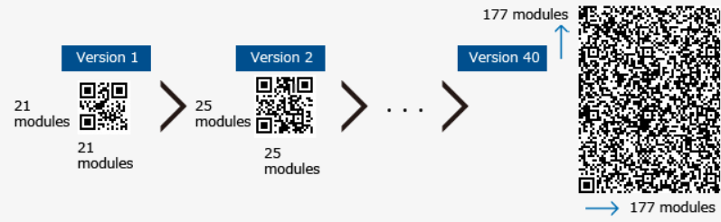

# SYM : Labo 3 - Environnement I (Codes-barres, iBeacons et NFC)

> Auteurs : Julien Béguin, Robin Cuénoud & Gaëtan Daubresse
> Date : 10.12.2020
> Classe : B

## 1. Introduction

Ce laboratoire contient différentes manipulations ayant pour objectif de nous apprendre à travailler avec des données environnementales. Nous allons nous intéressé aux codes barres, balises NFC et aux iBeacons. 

## 2. Balises NFC

Login : `admin ` `admin` . 

### Implémentation laboratoires

L’activité `NfcActivity` pourrait être lancé avec : 

```xml
<intent-filter>
    <action android:name="android.nfc.action.NDEF_DISCOVERED" />

    <category android:name="android.intent.category.DEFAULT" />

    <data android:mimeType="text/plain" />
</intent-filter>
```

Mais comme précisé dans le laboratoire elle est uniquement notifiée d’un tag `NDEF` lorsqu’elle est à l’écran. 

Pour ce qui est de la 2FA le choix suivant à été fait : 

* Lorsque l’activité NFC est lancée un fragment contenant la page de login apparaît celui-ci notifie grâce a une fonction de l’activité si le login est un succès. Note: les accès sont `admin` et `admin` . Cette page n’est plus affichée après (sauf fermeture complète de l’app). 

* Des le lancement de l’activité NFC l’app peut être notifiée d’un nouveau tag NFC `NDEF`  et uniquement lorsqu’elle est visible à l’écran. Si un tag contenant la chaîne `test` est scannée le niveau d’authentification passe a 15 et est ensuite décrémenté de 1 toutes les deux secondes pendant 20 secondes. Puis repasse à 0. 

Pour pouvoir “lire ” (avoir un `Toast` qui s’affiche avec `xx auth ok`) il faut avoir : 

* au moins 10 pour l’auth max
* au moins 5 pour l’auth medium 
* au moins 1 pour l’auth min 


> 2.4.1 Dans la manipulation ci-dessus, les tags NFC utilisés contiennent 4 valeurs textuelles codées en UTF-8 dans un format de message NDEF. Une personne malveillante ayant accès au porte-clés peut aisément copier les valeurs stockées dans celui-ci et les répliquer sur une autre puce NFC. A partir de l’API Android concernant les tags NFC3, pouvez-vous imaginer une autre approche pour  rendre  plus  compliqué  le  clonage  des  tags  NFC?Existe-il  des  limitations? Voyez-vous d’autres possibilités

NDEF n’a pas de protection contre le clonage. Grâce a l’API Android on pourrait utiliser différents tag. Avec  `getTechList()` on peut identifier la technologie du tag. Et il y’a des tag qui implémentent de la crypto ou d’autre mécanisme d’anti clonage. Notamment de chiffrer la clef sur la carte et qu’elle implémente un mécanisme encryptions et de communication.

  source: https://security.stackexchange.com/questions/63483/how-do-nfc-tags-prevent-copying

> 2.4.2 Est-ce qu’une solution basée sur la vérification de la présence d’un iBeacon sur l’utilisateur, par exemple sous la forme d’un porte-clés serait préférable? Veuillez en discuter.

Non car l’iBeacon à une grande portée donc un utilisateur pourrait s’authentifier avec l’iBeacon d’un autre utilisateur qui se trouverait par exemple dans la même pièce.  Ainsi le “vol” de ses credentials suffit à s’authentifier et le 2FA n’est pas efficace. 

## 3. Codes-barres

> 3.2.1 Quelle est la quantité maximale de données pouvant être stockée sur un QR-code ? Veuillez expérimenter, avec le générateur conseillé de codes-barres (QR), de générer différentes tailles de QR-codes. Pensez-vous qu’il est envisageable d’utiliser confortablement des QR-codes complexes (par exemple du contenant >500 caractères de texte ou une vCard très complète) ?

La taille maximale pouvant être stockée sur un QR-code dépend du nombre de ses modules. Un module correspond au point noir ou blanc dessinant le QR-code. 



La capacité de stockage du QR-code dépendra également de son niveau de correction. Un niveau élevé contiendra de la redondance dans le code afin d'éviter les erreurs. 

La version 40, qui est la plus grande taille des QR-code, contenant 177 x 177 modules, permet de stocker un maximum de 2 953 octets avec un niveau de redondance faible correspondant à 7%. 

En utilisant le générateur conseillé nous remarquons que cela ne pose pas de problème de créer des QR-code contentant plus de 500 caractères, indépendamment du niveau de correction définit. Cependant, cela pourrait ne pas être confortable à utiliser sachant que les éléments à l'intérieur de code deviennent très petits. Cela implique donc d'avoir une bonne qualité d'impression, un bon appareil photo ainsi que des bonnes conditions de luminosité lors du scan. 

[source](https://www.qrcode.com/)

> 3.2.2 Il existe de très nombreux services sur Internet permettant de générer des QR-codes
> dynamiques. Veuillez expliquer ce que sont les QR-codes dynamiques. Quels sont les avantages et respectivement les inconvénients à utiliser ceux-ci en comparaison avec des QR-codes statiques. Vous adapterez votre réponse à une utilisation depuis une plateforme mobile.

Les codes QR dynamiques contiennent une URL permettant de rediriger l'utilisateur vers ce liens. 

Cela offre les avantages suivants : 

- Possibilité de modifier le contenu vers lequel le QR-code pointe sans devoir changer le QR code lui même.
- Les QR dynamiques sont souvent plus faciles à scanner car moins dense. 
- Possibilité de tenir une statistique sur le nombre de fois qu'un code à été scanné en regardant le nombre de requête sur la page vers laquelle le code redirige. 

Un désavantage que nous pourrions trouver est que cela oblige l'utilisateur à avoir une connexion internet pour être capable d’accéder à l'information. 

[source](https://www.sony.fr/electronics/support/articles/00248593)  

## 4. Balises iBeacon

### Implémentation

Références :

- Utilisation de la librairie *Android Beacon Library* permettant d’interagir avec les beacons : 
  - https://altbeacon.github.io/android-beacon-library/samples.html#ranging-example-code
- Création et utilisation de RecyclerView :
  - https://developer.android.com/guide/topics/ui/layout/recyclerview

### Question

> *Les iBeacons sont très souvent présentés comme une alternative à NFC. Vous commenterez cette affirmation en vous basant sur 2-3 exemples de cas d’utilisations (use-cases) concrets (par exemple e-paiement, second facteur d’identification, accéder aux horaires à un arrêt de bus, etc.).*

Le iBeacon est un système de positionnement en intérieur développé par Apple. Il offre une grande distance d'émissions allant jusqu'à ~70m alors que le NFC va jusqu'à ~10cm (des iBeacons longue portée peuvent même aller jusqu'à ~450m). Néanmoins, les iBeacons sont très sensibles aux interférences radios et aux obstacles.

Les iBeacons ont également l'avantage de diffuser à plusieurs client en même temps. Cela peut devenir un problème de sécurité où un attaquant pourrait spoofer un beacon et l'utiliser de façon malveillante.

Voici quelques cas d'utilisation pratique :

- **Afficher le menu en ligne dans un restaurant :**

  L'objectif sera d'envoyer la carte du menu aux clients d'un restaurant lors de leurs arrivées. Pour cela, iBeacon est plus adapté car le client n'a pas besoin de venir scanner une balise comme ça serait le cas pour NFC. La carte serait reçu dès que le client entre dans la zone du restaurant. Deuxièmement, iBeacon serait plus économique car un seul iBeacon peut émettre à plusieurs client en même temps. Il faut donc moins de balise.

- **Paiement sans contact :**

  Dans ce deuxième cas, il est préférable d'utiliser NFC au lieu de iBeacon car iBeacon diffuse de façon complètement visible toutes ces informations et cela dans un rayon de 70m. Si l'application est mal implémenté, il serait possible qu'un attaquant puisse faire effectuer un paiement non voulu à la victime en spoofant le iBeacon. Le spoofing étant très facile à effectuer puisqu'il suffit de se situer à moins de 70m de la baliser et d'écouter ces émissions. A l'inverse, NFC émet à très faible distance (~10cm) ce qui est plus difficile à intercepter pour un attaquant. NFC fournit également des fonctions de chiffrements qui permettent de garantir la confidentialité des données.

- **Publicité dans un magasin :**

  Le but serait d'afficher les nouveaux produits et les soldes présent dans le magasin. Pour cela, le iBeacon est plus adapté car il couvre toute une zone, de la même façon que pour le restaurant.

En conclusion, les iBeacons ne sont pas une alternative complète à NFC. Le choix de la technologie dépend du cas d'utilisation. Les iBeacons sont plus adaptés lorsqu'un faut émettre à plusieurs utilisateurs dans une grande zone et le NFC est plus adapté pour transmettre des informations sensible.


## 5. Conclusion

Ce laboratoire nous a permis de nous familiariser avec les différents moyens de travailler avec les données environnementales. Nous avons pu en apprendre en apprendre d'avantage sur les technologies utilisées par les balises NFC, les iBeacons ainsi que les codes barres. 

Nous n'avons pas rencontrer des difficulté particulière au cours de ce travail.  